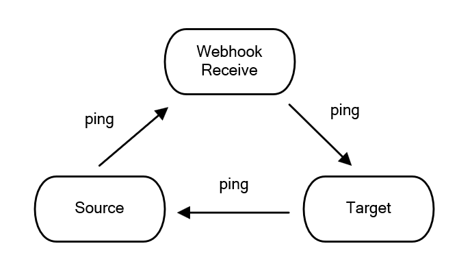

# 【gitea仓库镜像备份自动化】

## 功能与介绍

- 【功能】在source gitea创建仓库时，触发webhook，在target仓库上创建同名仓库，设置为定时拉取镜像仓库。
- 【Tips】gitea中镜像仓库有两种，一种是推送，一种是拉取。
    - 【推送镜像】在仓库更新时，推送到其他的远程仓库。在主仓库，source仓库中设置。
        - 【注】这里没有使用这种方式的原因是，备份仓库在内网，虽然有已经组网，但是拉取的时候用公网IP，设置后之后，就算组网服务失效，也能稳定运行。后期组网IP变化也不影响备份链路
    - 【拉取镜像】定时从其他仓库中拉取，只能在仓库创建的时候，设置为拉取镜像。本服务端用的是这种方式。在备份仓库，target仓库中设置。

## 先决条件

- 涉及到三方面的host
    - source：需要备份的仓库
    - target：备份到的仓库
    - webhook receiver：接收source的webhook，并进行备份
- 网络拓扑至少要满足如下条件：（本次测试时使用tailscale将三端组网了，建议这样使用）



## 准备：克隆准备好的代码

```yaml
cd Workspace
mkdir 20250319gitea_hooker
cd 20250319gitea_hooker
git clone https://github.com/Ray005/gitea_auto_backup.git/
cd gitea_auto_backup/dockerfile
```

## 步骤一：主仓库webhook设置

- 设置→Web钩子→添加Web钩子
- 【主仓库gitea创建webhook】我这里的逻辑是在主仓库创建了的仓库会触发一个webhook，在服务端处理，在备份仓库中创建仓库并设置镜像
    - 右上角设置→Web钩子→添加Web钩子
    - 【目标URL】填服务端的地址加端口
    - 【密钥明文】填上面设置的WEBHOOK_SECRET
    - 【触发条件】选仓库创建活删除仓库
    - 【激活】勾选激活，最后完成创建钩子

## 步骤二：Access Token：备份仓库、主仓库

- 【注】主仓库的Access Token是给备份仓库拉取时用的、备份仓库的token是在创建仓库时用的。
- 【Access Token】在备份和主仓库中 设置→应用→管理Access Token→增加令牌。选择上repository和package权限即可。
    - 【注意】这个令牌只显示一次，生成后记得保存下来
    - 【注意】备份仓库的用户名要知道，方便后面使用


## 步骤三：编译镜像

```yaml
cd gitea_auto_backup/dockerfile
bash build.sh
```

## 步骤四：容器部署

- 如果失效，重启容器即可，如下的always_restart配置，如果出现错误死了会自动重启

```yaml
# 编辑容器中的配置文件，填写恰当的如下参数
vim run.sh

-p 5000:5000 \ # 前一个为主机端口，选择后记得在防火墙开放。端口用来接收webhook
-e TARGET_GITEA_URL=https://100.102.101.xx:8418 \ # target的gitea地址
-e TARGET_GITEA_TOKEN=9xxxxxxxxxxxa \ # target的gitea token
-e TARGET_GITEA_USERNAME=xxx \ # target的gitea username
-e SOURCE_GITEA_URL="http://xxxx:3000" \ # source的gitea地址
-e SOURCE_GITEA_TOKEN="bxxxxxxxxxxxxxxxxx3" \ # source的gitea token
-e SOURCE_GITEA_USERNAME=xxx \ # source的gitea username
-e WEBHOOK_SECRET=xxxxxx \ # 与source的webhook secret一致（在创建source的webhook时设置）

# 运行容器
bash run.sh
```

## Trouble Shooting
<details>
    <summary>点击展开</summary>

## 【调试】调试python脚本、建立webhook【可跳过】

### 首先check

* **【环境变量】**有没有都给，少一个在运行python的时候出错就会停止服务。
* **【运行】**如果有错可以把run的 **-d** 换成 **-it** 看执行情况
* **【端口】**运行后有没有在防火墙开放端口

### 调试

- 【注】后面运行如果不行再回来测试这一步
- 【注】部署后很难调试，尽量调试好了再部署。
- 【服务器端运行服务脚本】这是一个服务端的python脚本，将要在docker中运行（阻塞式的，所以容易调试）
    - 保存这个仓库之后，直接python webhook_receiver.py来启动服务，确保所有事情都通了再放到容器中部署
        
        ```yaml
        python webhook_receiver.py
        ```
        
    - 设置环境变量：
        
        ```yaml
        export TARGET_GITEA_URL=http://xx.xx.xx.xx:8418 # 备份仓库的地址
        export TARGET_GITEA_TOKEN=90fxxxxxxxxxxxxxxx # 在备份仓库中新建一个Token
        export TARGET_GITEA_USERNAME=xxxx # 备份仓库中的用户名
        export SOURCE_GITEA_URL="http://xxxx:3000" \ 
        export SOURCE_GITEA_TOKEN="bxxxxxxxxxxxxxxxxx3" \ 
        export SOURCE_GITEA_USERNAME=xxx \
        export WEBHOOK_SECRET=xxx # webhook的密码，这个密码和下面主仓库创建webhook时需要一致才能完成推送
        export PORT=3003 # webhooker的服务端口，如果是公网环境记得开放这个端口
        ```
        
- 【测试webhook】这时创建一个仓库来测试webhooker是否正常工作。创建完成后回到Gitea设置界面的web钩子界面发现会有“最近的推送记录”，这里就能发现推送事件是否正常，如果返回是超时，就要考虑网络是不是不同，确认防火墙有没有开放
- 【debug记录】请求路径问题
    - 【问题】请求的路径没找到
    
    ```yaml
    <!DOCTYPE HTML PUBLIC "-//W3C//DTD HTML 3.2 Final//EN">
    <title>404 Not Found</title>
    <h1>Not Found</h1>
    <p>The requested URL was not found on the server. If you entered the URL manually please check your spelling and try again.</p>
    ```
    
    - 【原因】出现404错误是因为webhook的URL路径不正确。服务器代码监听的是'/webhook'路径，但请求似乎发送到了根路径'/'。把服务端监听改为/即可

</details>
